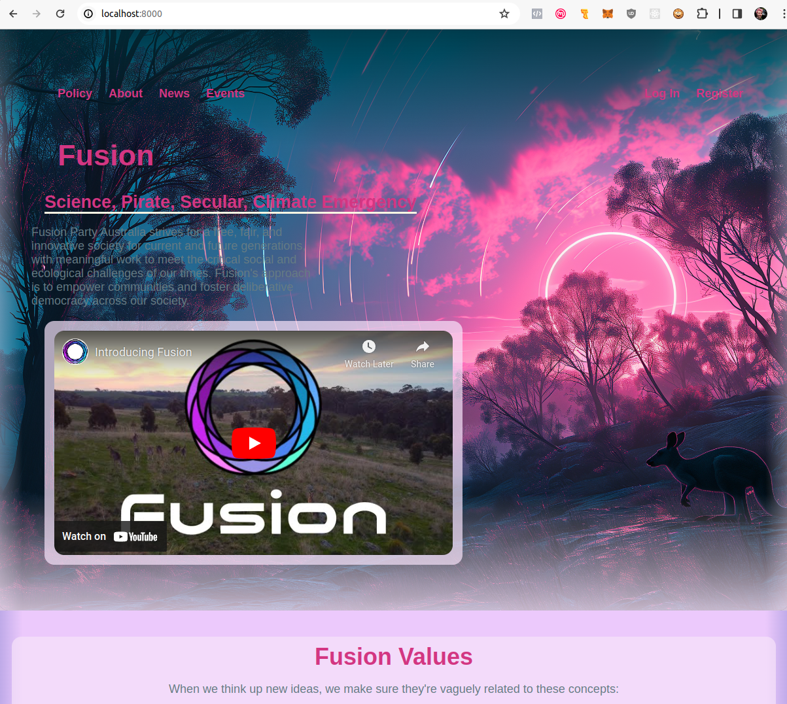

# Fusion website sample
This project aims to create a hardcoded website that *appears to be* a viable website for the 
[Fusion Party](https://www.fusionparty.org.au/).

Once this project is largely complete, the site will then be ported to
Underground CRM, using a more templated approach to allow easier editing, plus the sharing of code with other
organisations.

If you'd like to see what the website currently looks like (if you were to run the site), it is similar to this:

> 
> There should ideally be screenshots accompanying 
> [each substantial commit](https://github.com/owen9825/fusion_demo/commits/master/).

## Installation
* Install [Python](https://www.python.org/)
* Install [npm](https://docs.npmjs.com/downloading-and-installing-node-js-and-npm)
* Install the npm packages for this project:
  ```shell
  npm install
  ```

## Running the website
Running the demo:
* In one window, listen to sass changes, for compiling to CSS:
  ```shell
  sass --watch style.scss:style.css
  ```
* In another window, serve the web application:
  ```shell
  python -m http.server
  ```
* In your browser, visit <http://localhost:8000>, as instructed by the Python output.

## Contributing
Please fork the project and issue a PR to merge it back into master here.

## Future work:
* Policy page
* An article page
* A biography page
